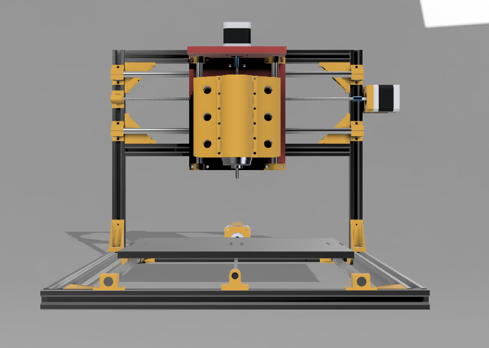
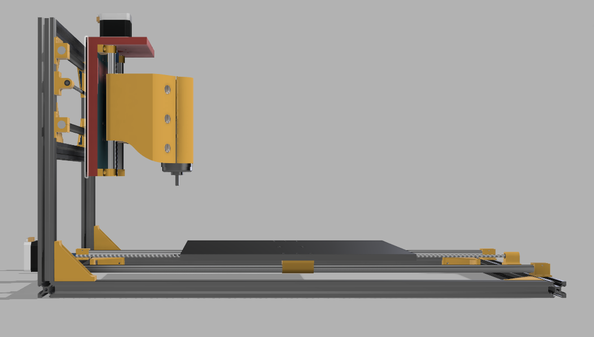
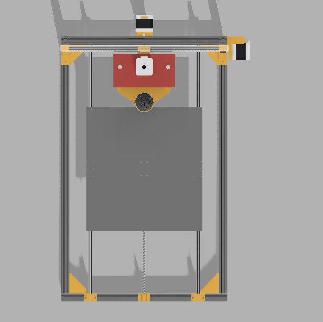
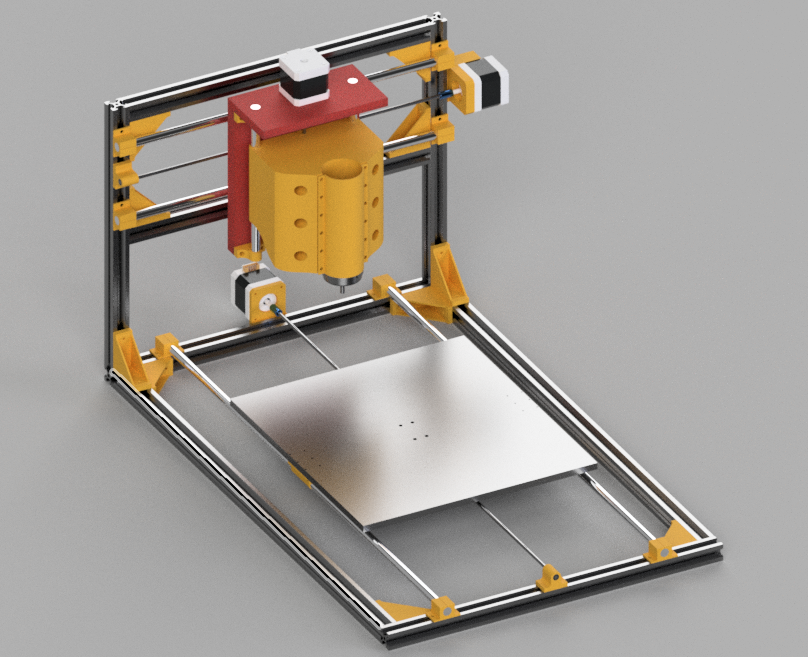

# CNC-Router

This is my homemade CNC machine. It started as an idea and slowly turned into a full mission . I designed everything in Fusion 360, with 3d printed brackets. i also researched the parts, and carefully choosed components. I’m not calling it perfect, its **beautiful** and i like it  .

## Why I Made This

To get more hands on experience ? this is a very cool project. A CNC that can carve wood and maybe on a good day cut aluminuim, isn't that great ?

## 3D Model 

### Front View

### Side View

### Top View

### Full Assembly

This is quite long, maybe I should make it shorter
## Wiring Diagram

still didn't start this phase so y'all gonna need to wait !

## BOM (Bill of Materials)

Here the secret sauce

| Item                                     | Quantity | Unit | Notes                                   |
| ---------------------------------------- | -------- | ---- | --------------------------------------- |
| T8 Lead Screw 2mm lead 500 mm (with nut) | 1        | pcs  | One per axis; anti-backlash recommended |
| T8 screw round                           | 10       | pcs  |                                         |
| LM8UU linear bearing                     | 4        | pcs  | Two per platform                        |
| NEMA17 stepper motor                     | 3        | pcs  |                                         |
| M5 T-nut for 2020 extrusion              | 100      | pcs  |                                         |
| Shaft decoupler                          | 5        | pcs  | One per lead screw                      |
| Limit switch (mechanical)                | 5        | pcs  | X+/X-, Y+/Y-, Z+/Z-                     |
| Smooth shaft ~8mm x 500mm                | 2        | pcs  | Works with LM8UU                        |
| 2020 T-slot extrusion 300mm              | 4        | pcs  |                                         |
| Emergency stop button                    | 1        | pcs  |                                         |
| Spindle                                  | 1        | —    |                                         |
| 4 flute HRC65 end mill                   | 4        | —    |                                         |

More things will probably get added because that’s how these builds go. But for now, this is the heart of the machine.

