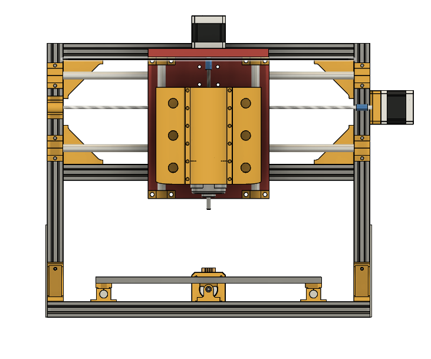
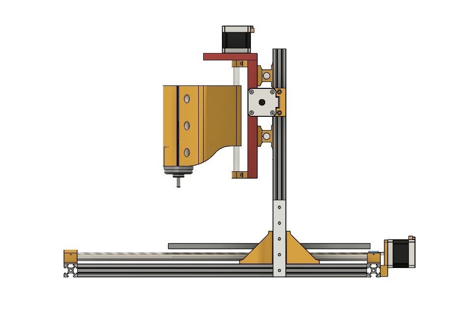
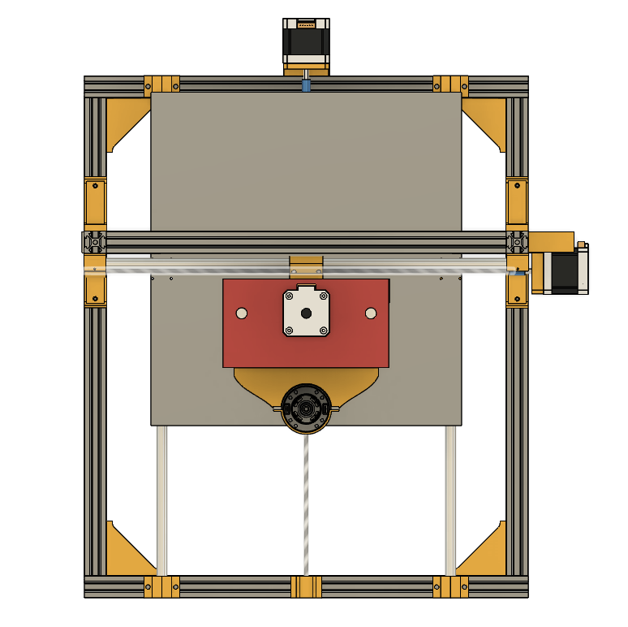
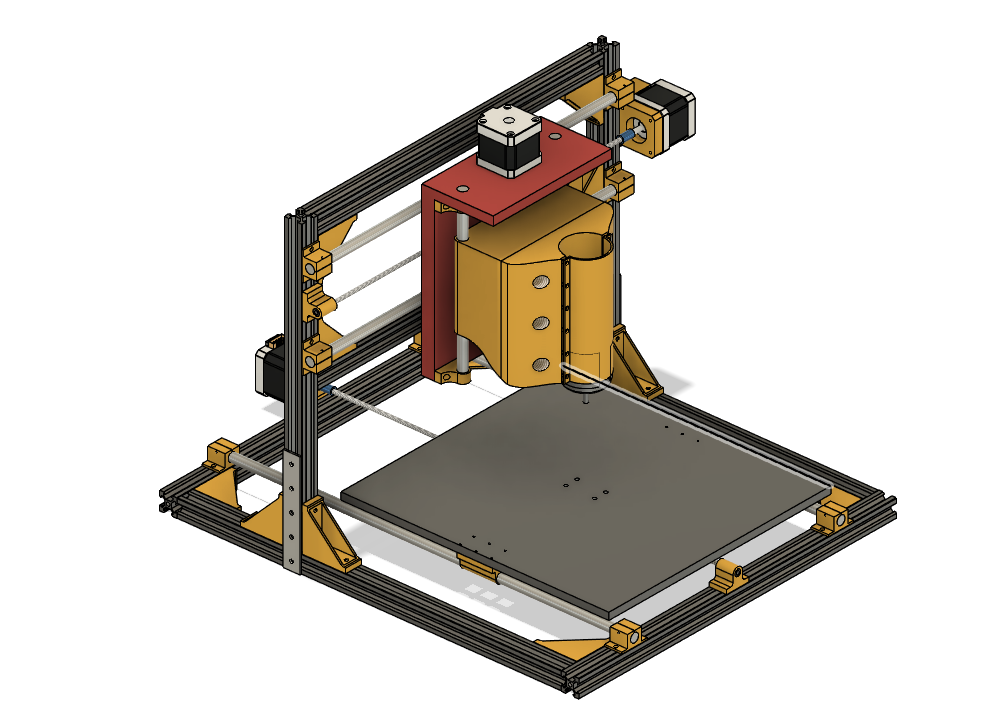

# CNC-Router

This is my homemade CNC machine. It started as an idea and slowly turned into a full mission . I designed everything in Fusion 360, with 3d printed brackets. i also researched the parts, and carefully choosed components. I’m not calling it perfect, its **beautiful** and i like it  .

## Why I Made This

To get more hands on experience ? this is a very cool project. A CNC that can carve wood and maybe on a good day cut aluminuim, isn't that great ?

## 3D Model 

### Front View

### Side View

### Top View

### Full Assembly

## Wiring Diagram

still didn't start this phase so y'all gonna need to wait !

## BOM (Bill of Materials)

Here is the secret sauce!!

| Item                                     | Quantity | Unit | price  (in mad and usd)                              |
| ---------------------------------------- | -------- | ---- | --------------------------------------- |
| T8 Lead Screw 2mm lead 500 mm (with nut) | 1        | pcs  |   67.8    ($7.32)                                    |
| T8 screw round                           | 10       | pcs  |   46.65      ($5.04)                                 |
| LM8UU linear bearing                     | 4        | pcs  |     42.8     ($4.63)                                 |
| NEMA17 stepper motor                     | 3        | pcs  |   240       ($25.92)                                 |
| M5 T-nut for 2020 extrusion              | 100      | pcs  |    76.77      ($8.30)                                |
| Shaft decoupler                          | 5        | pcs  |      71.52       ($7.73)                             |
| Limit switch (mechanical)                | 5        | pcs  |        29.73        ($3.21)                          |
| Smooth shaft ~8mm x 500mm                | 2        | pcs  |         134            ($14.47)                      |
| 2020 T-slot extrusion 300mm              | 4        | pcs  |          273              ($29.48)                   |
| Emergency stop button                    | 1        | pcs  |              36              ($3.89)                 |
| Spindle                                  | 1        | pcs  |                   282           ($30.46)             |
| 4 flute HRC65 end mill                   | 4        | pcs  |                     29.73           ($3.21)          |
| Esp-32 wroom32                           |  1       | pcs  |            18.86      ($2.04)                        |
| Capacitor 100uF                 | 40        | pcs   |                          135.35 ($14.62)                    |
| DRV8825              |5      | pcs   |                       45.88 ($4.95)                                        |
| irlz44n            |10     | pcs   |                       9.87 ($1.07)                                           |
| 1N5819          |50     | pcs   |                       9.87 ($1.07)                                              |
| Screw terminal         |10     | pcs   |                       83.08 ($9.04)                                      |
| Pin headers 1*40pin        |10     | pcs   |                      14.56 ($1.58)                                   |

### Total 
- in Mad : 1647.47  
- in Dollar : 178.03
